# Online Readme 
If you are not able to view this readme locally, please visit: [https://github.com/johnnykungdev/patlytics-app-md](https://github.com/johnnykungdev/patlytics-app-md)

# Patlytics Application

Patlytics is a web application designed to help users analyze potential patent infringements. This README provides instructions on how to set up and run the application locally.

# Pre-requisite
- OpenAI API key
- Docker installed on your machine
- __Recommend: Use WSL if you are on a Windows machine__

# Local Setup
1. Create an `.env` file in the project root folder and put the OpenAI API key as
```
OPENAI_API_KEY=<put your API key here>
```

you will need to find your Open AI key by visiting [https://platform.openai.com/](https://platform.openai.com/) and visit the dashboard. Go to the API Key section and create one if you don't already have it

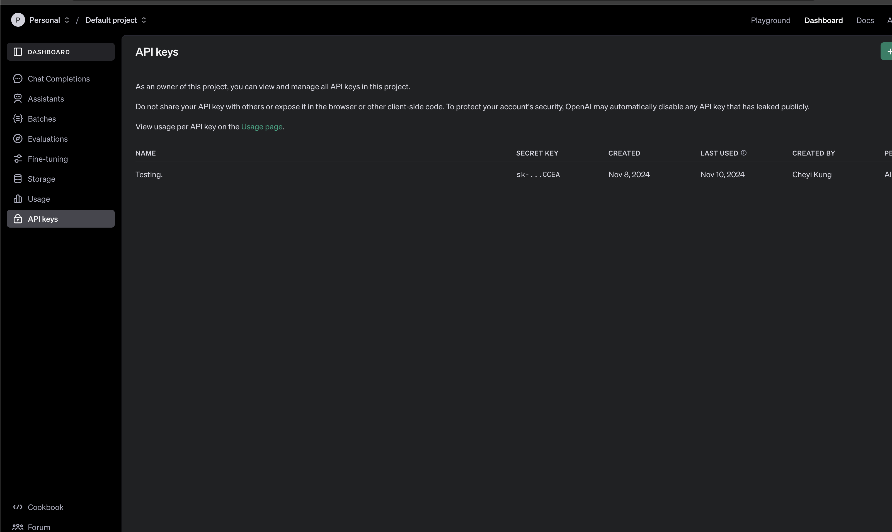

2. In the terminal, in the root path of the application, run `sudo docker build -t patlytics-app .` or equivalent command

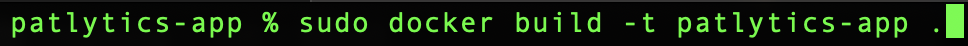

It may takes a while to finish the build. Wait until it is finished

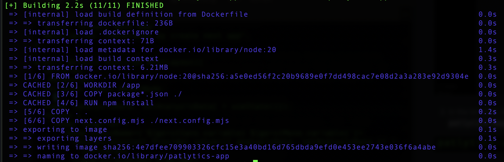

3. In the terminal, in the root path of the application, run the command `sudo docker run -p 3000:3000 patlytics-app`

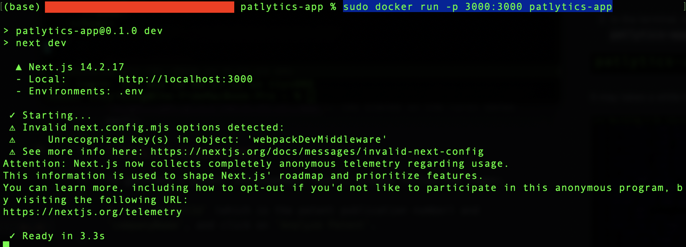

4. Once the build is finished, visit `http://localhost:3000` and you should be able to see the home page. It may take some time to load the page or the analysis report in the beginning.

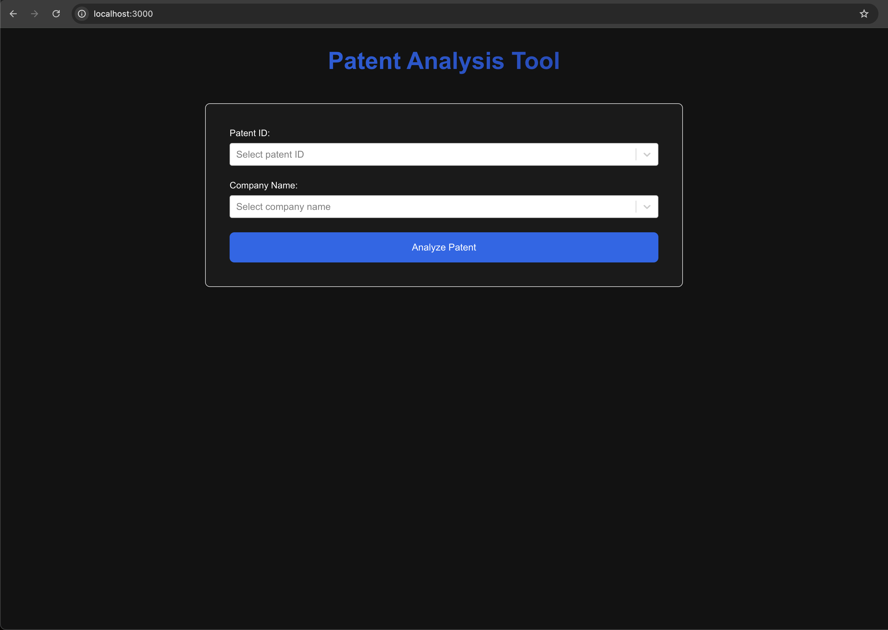

## ** Note: Development setup with hot reloading

For development purpose, we would want to reflect our code changes with docker.

- In the terminal, in the project root folder, run the command `sudo docker-compose up --build`. If you installed Docker Desktop on Windows or Mac, you should be able to run this command. If you are on linux, you may need to install Docker Compose separately.

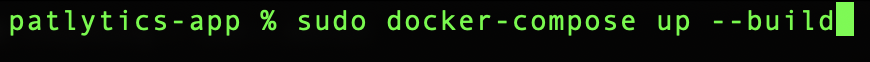


# Live website

The application is also hosted at [https://patlytics-sable.vercel.app/](https://patlytics-sable.vercel.app/). (As stated in the first bonus part);

# Using the Analysis tool

To generate a patent infringement report, please follow the steps:

1. Put `patentId` (which is the patent publication number) and `companyName`, and click on `Analyze Patent`.

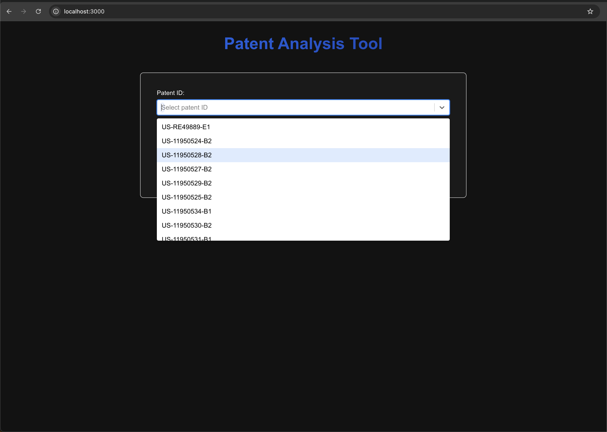

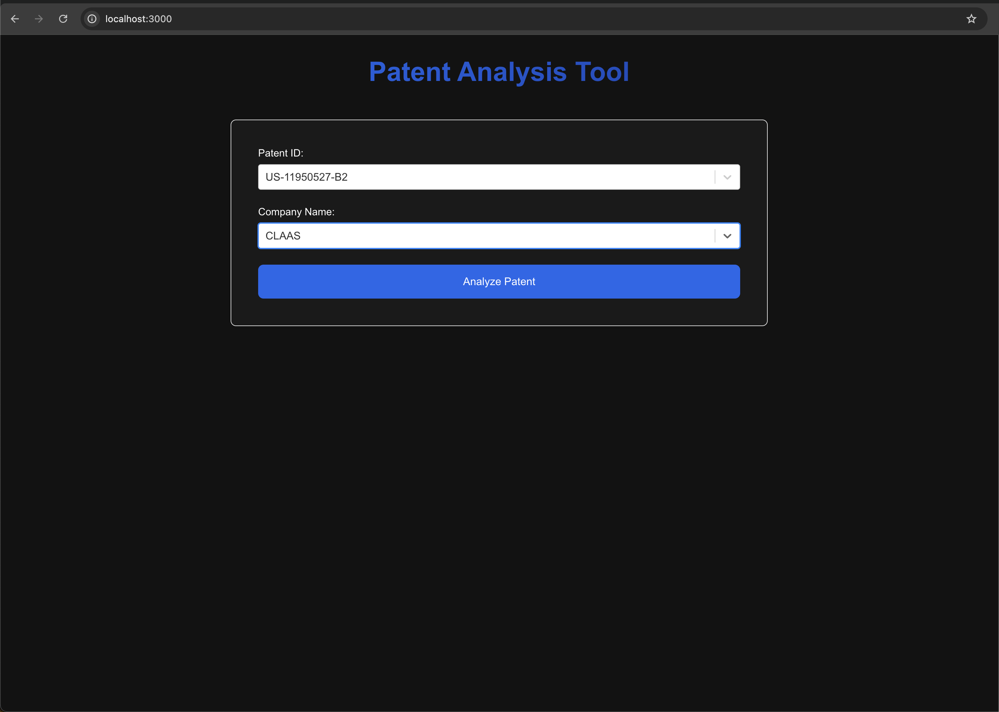

2. It will take some time for Open AI services to analyze the top two potential infringing products.

3. Once the analysis is finished, it will be directed to the analysis report page.

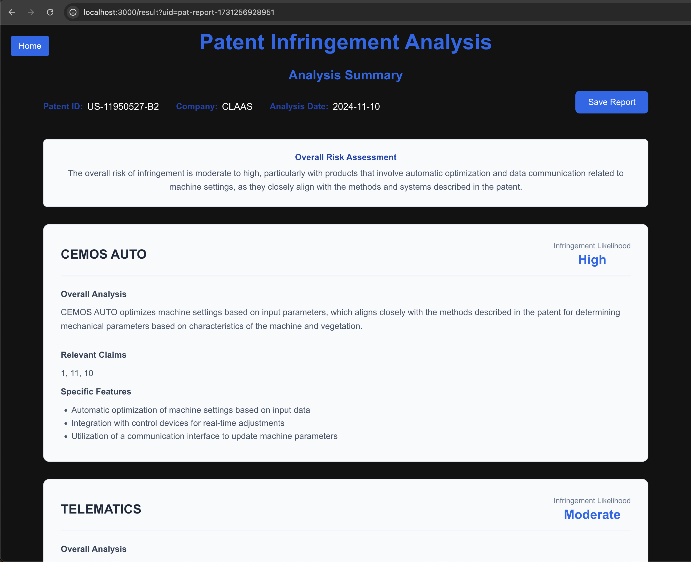

4. You can click on the `Save Report` button to save the report locally.

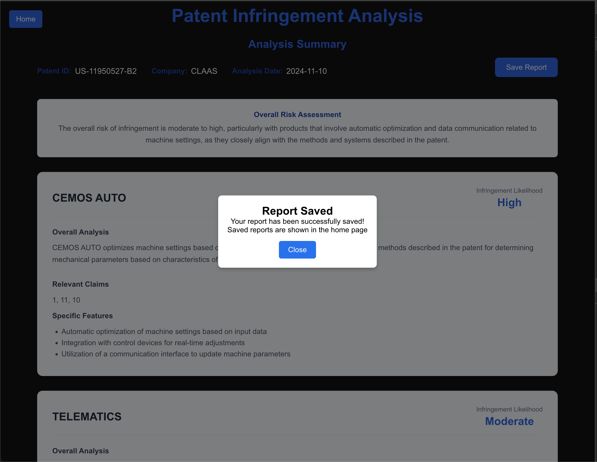

5. Once a report is saved, you can see it on the home page.

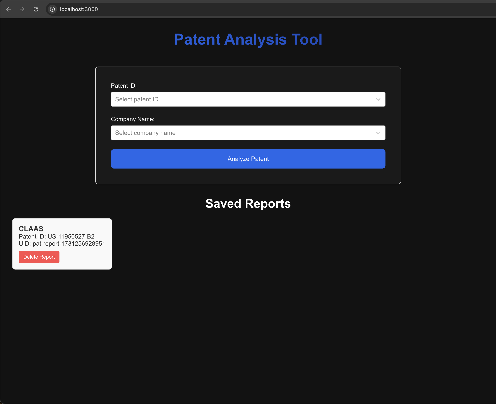

6. Click on the report card on the home page to view the report, or delete the report if you don't need it anymore.

# Bonus Points
- The application is hosted with Vercel. I didn't create an AWS EC2 instance since setting the instance, NGINX, and some related services would take extra time.

- For fuzzy searching, it's applied with the react-select component (The input component that has dropdown showing results from typed content), I used fuse.js for searching the related results.

- For saving the reports, I saved the report data in localStorage since this is the fastest way to develop this feature. In real world, I would store the reports in the db and create relation with user accounts in a relational database.
